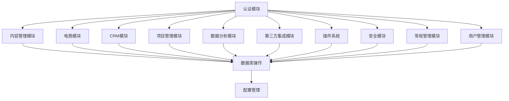
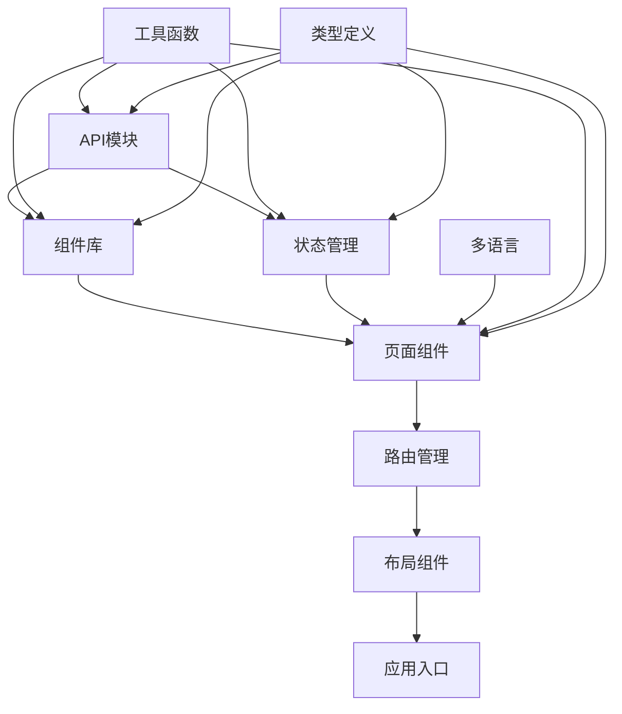

# AdminCraft 框架结构文档

## 1. 项目架构概述

AdminCraft 采用前后端分离架构，后端基于 ThinkPHP 8.1.1，前端基于 Vue 3.5.13 + TypeScript + Element Plus。系统设计遵循模块化、可扩展性和可维护性原则，支持企业级应用开发。

## 2. 目录结构

### 2.1 后端目录结构

```
├── app/                  # 应用目录
│   ├── admin/            # 后台管理模块
│   │   ├── controller/   # 控制器
│   │   ├── model/        # 模型
│   │   ├── validate/     # 验证器
│   │   ├── lang/         # 语言包
│   │   ├── library/       # 工具库
│   │   └── common.php    # 公共函数
│   ├── api/              # API接口模块
│   │   ├── controller/   # 控制器
│   │   ├── validate/     # 验证器
│   │   ├── lang/         # 语言包
│   │   └── common.php    # 公共函数
│   ├── common/           # 公共模块
│   │   ├── controller/   # 基础控制器
│   │   ├── model/        # 基础模型
│   │   ├── library/       # 公共库
│   │   ├── middleware/    # 中间件
│   │   ├── service/       # 服务层
│   │   └── event/         # 事件
│   ├── AppService.php    # 应用服务
│   ├── BaseController.php # 基础控制器
│   ├── ExceptionHandle.php # 异常处理
│   └── Request.php       # 请求处理
├── config/               # 配置目录
│   ├── app.php           # 应用配置
│   ├── database.php      # 数据库配置
│   ├── route.php         # 路由配置
│   ├── cache.php         # 缓存配置
│   ├── log.php           # 日志配置
│   ├── upload.php        # 上传配置
│   └── ...               # 其他配置
├── database/             # 数据库目录
│   └── migrations/       # 数据库迁移
├── extend/               # 扩展目录
│   └── ba/               # BuildAdmin 扩展
├── modules/              # 模块目录
├── public/               # 公共目录
│   ├── index.php         # 入口文件
│   ├── static/           # 静态资源
│   └── install/          # 安装目录
├── runtime/              # 运行时目录
├── composer.json         # Composer 配置
├── composer.phar         # Composer 可执行文件
└── think                 # 命令行工具
```

### 2.2 前端目录结构

```
├── web/                  # 前端目录
│   ├── src/              # 源码目录
│   │   ├── api/          # API请求
│   │   ├── assets/       # 静态资源
│   │   ├── components/    # 组件
│   │   ├── lang/          # 多语言
│   │   ├── layouts/       # 布局
│   │   ├── router/        # 路由
│   │   ├── stores/        # 状态管理
│   │   ├── styles/        # 样式
│   │   ├── utils/         # 工具函数
│   │   ├── views/         # 页面组件
│   │   ├── App.vue        # 根组件
│   │   └── main.ts        # 入口文件
│   ├── public/            # 公共资源
│   ├── types/             # TypeScript 类型定义
│   ├── .env               # 环境变量
│   ├── .env.development   # 开发环境变量
│   ├── .env.production    # 生产环境变量
│   ├── package.json        # NPM 配置
│   ├── vite.config.ts      # Vite 配置
│   ├── tsconfig.json       # TypeScript 配置
│   └── eslint.config.js   # ESLint 配置
```

## 3. 核心模块设计

### 3.1 后端核心模块

#### 3.1.1 认证模块
- **功能**：用户登录、权限管理、角色管理
- **文件位置**：`app/admin/controller/auth/`
- **关键文件**：
  - `Admin.php` - 管理员管理
  - `Group.php` - 角色管理
  - `Rule.php` - 权限规则管理
  - `DataPermission.php` - 数据权限管理
  - `PermissionInherit.php` - 权限继承管理

#### 3.1.2 内容管理模块
- **功能**：文章、分类、标签管理
- **文件位置**：`app/admin/controller/content/`
- **关键文件**：
  - `Article.php` - 文章管理
  - `Category.php` - 分类管理
  - `Tag.php` - 标签管理

#### 3.1.3 电商模块
- **功能**：商品、分类、订单管理
- **文件位置**：`app/admin/controller/ecommerce/`
- **关键文件**：
  - `Goods.php` - 商品管理
  - `Category.php` - 商品分类管理
  - `Order.php` - 订单管理

#### 3.1.4 CRM模块
- **功能**：客户管理、销售漏斗、跟进记录
- **文件位置**：`app/admin/controller/crm/`
- **关键文件**：
  - `Customer.php` - 客户管理
  - `SalesFunnel.php` - 销售漏斗管理

#### 3.1.5 项目管理模块
- **功能**：项目、任务、团队协作
- **文件位置**：`app/admin/controller/project/`
- **关键文件**：
  - `Project.php` - 项目管理
  - `Task.php` - 任务管理

#### 3.1.6 数据分析模块
- **功能**：仪表盘、报表、数据可视化
- **文件位置**：`app/admin/controller/analytics/`
- **关键文件**：
  - `Dashboard.php` - 仪表盘管理
  - `Report.php` - 报表管理
  - `Chart.php` - 图表管理
  - `Visualization.php` - 数据可视化管理

#### 3.1.7 第三方集成模块
- **功能**：支付、短信、邮件、云存储、社交媒体
- **文件位置**：`app/admin/controller/`
- **关键文件**：
  - `payment/` - 支付管理
  - `sms/` - 短信管理
  - `email/` - 邮件管理
  - `storage/` - 云存储管理
  - `social/` - 社交媒体管理

#### 3.1.8 插件系统
- **功能**：插件管理、钩子管理
- **文件位置**：`app/admin/controller/plugin/`
- **关键文件**：
  - `Plugin.php` - 插件管理
  - `Hook.php` - 钩子管理

#### 3.1.9 安全模块
- **功能**：数据回收、敏感数据保护
- **文件位置**：`app/admin/controller/security/`
- **关键文件**：
  - `DataRecycle.php` - 数据回收管理
  - `DataRecycleLog.php` - 数据回收日志
  - `SensitiveData.php` - 敏感数据管理
  - `SensitiveDataLog.php` - 敏感数据操作日志

#### 3.1.10 常规管理模块
- **功能**：管理员信息、附件管理、系统配置
- **文件位置**：`app/admin/controller/routine/`
- **关键文件**：
  - `AdminInfo.php` - 管理员信息管理
  - `Attachment.php` - 附件管理
  - `Config.php` - 系统配置管理

#### 3.1.11 用户管理模块
- **功能**：用户管理、用户组管理、用户规则管理
- **文件位置**：`app/admin/controller/user/`
- **关键文件**：
  - `User.php` - 用户管理
  - `Group.php` - 用户组管理
  - `Rule.php` - 用户规则管理
  - `MoneyLog.php` - 资金日志管理
  - `ScoreLog.php` - 积分日志管理

### 3.2 前端核心模块

#### 3.2.1 API模块
- **功能**：封装后端API请求
- **文件位置**：`web/src/api/`
- **关键文件**：
  - `backend/` - 后台API
  - `frontend/` - 前台API
  - `common.ts` - 公共API配置

#### 3.2.2 组件库
- **功能**：可复用组件
- **文件位置**：`web/src/components/`
- **关键文件**：
  - `baInput/` - 表单输入组件
  - `table/` - 表格组件
  - `advancedForm/` - 高级表单组件
  - `visualization/` - 数据可视化组件
  - `layout/` - 布局组件
  - `clickCaptcha/` - 点击验证码组件
  - `contextmenu/` - 右键菜单组件
  - `formItem/` - 表单项目组件
  - `icon/` - 图标组件
  - `terminal/` - 终端组件

#### 3.2.3 状态管理
- **功能**：全局状态管理
- **文件位置**：`web/src/stores/`
- **关键文件**：
  - `adminInfo.ts` - 管理员信息
  - `userInfo.ts` - 用户信息
  - `config.ts` - 系统配置
  - `navTabs.ts` - 导航标签
  - `baAccount.ts` - 账户管理
  - `memberCenter.ts` - 会员中心
  - `siteConfig.ts` - 站点配置
  - `terminal.ts` - 终端管理

#### 3.2.4 路由管理
- **功能**：前端路由配置
- **文件位置**：`web/src/router/`
- **关键文件**：
  - `index.ts` - 路由配置
  - `static/` - 静态路由

#### 3.2.5 多语言
- **功能**：国际化支持
- **文件位置**：`web/src/lang/`
- **关键文件**：
  - `backend/` - 后台语言包
  - `frontend/` - 前台语言包
  - `common/` - 公共语言包
  - `autoload.ts` - 语言包自动加载

#### 3.2.6 页面组件
- **功能**：前端页面
- **文件位置**：`web/src/views/`
- **关键文件**：
  - `backend/` - 后台页面
  - `frontend/` - 前台页面
  - `common/` - 公共页面

#### 3.2.7 工具函数
- **功能**：工具函数
- **文件位置**：`web/src/utils/`
- **关键文件**：
  - `axios.ts` - HTTP请求封装
  - `baTable.ts` - 表格工具
  - `build.ts` - 构建工具
  - `common.ts` - 公共工具
  - `directives.ts` - 自定义指令
  - `storage.ts` - 存储工具
  - `validate.ts` - 验证工具

## 4. 配置文件

### 4.1 后端配置

#### 4.1.1 应用配置 (`config/app.php`)
- **功能**：应用基本配置
- **主要配置项**：
  - 应用地址
  - 应用命名空间
  - 路由设置
  - 默认应用
  - 默认时区
  - 应用映射
  - 域名绑定
  - 禁止访问的应用列表

#### 4.1.2 数据库配置 (`config/database.php`)
- **功能**：数据库连接配置
- **主要配置项**：
  - 数据库类型
  - 主机地址
  - 数据库名
  - 用户名
  - 密码
  - 端口
  - 数据库编码
  - 表前缀
  - 连接参数

#### 4.1.3 路由配置 (`config/route.php`)
- **功能**：路由规则配置
- **主要配置项**：
  - pathinfo分隔符
  - URL伪静态后缀
  - 路由延迟解析
  - 强制使用路由
  - 控制器层名称
  - 默认控制器
  - 默认操作

#### 4.1.4 缓存配置 (`config/cache.php`)
- **功能**：缓存配置
- **主要配置项**：
  - 默认缓存驱动
  - 缓存连接方式
  - 缓存保存目录
  - 缓存前缀
  - 缓存有效期

#### 4.1.5 日志配置 (`config/log.php`)
- **功能**：日志配置
- **主要配置项**：
  - 默认日志记录通道
  - 日志记录级别
  - 日志通道配置
  - 日志保存目录
  - 日志格式

#### 4.1.6 上传配置 (`config/upload.php`)
- **功能**：文件上传配置
- **主要配置项**：
  - 上传路径
  - 允许的文件类型
  - 文件大小限制
  - 存储方式

### 4.2 前端配置

#### 4.2.1 环境变量 (`web/.env`)
- **功能**：环境变量配置
- **主要配置项**：
  - API基础URL
  - 构建模式
  - 其他环境变量

#### 4.2.2 开发环境变量 (`web/.env.development`)
- **功能**：开发环境变量配置
- **主要配置项**：
  - 开发服务器端口
  - 开发模式配置
  - 开发环境特定变量

#### 4.2.3 生产环境变量 (`web/.env.production`)
- **功能**：生产环境变量配置
- **主要配置项**：
  - 生产服务器配置
  - 生产模式配置
  - 生产环境特定变量

#### 4.2.4 NPM配置 (`web/package.json`)
- **功能**：项目依赖管理
- **主要配置项**：
  - 项目信息
  - 依赖包
  - 脚本命令
  - 构建配置

#### 4.2.5 Vite配置 (`web/vite.config.ts`)
- **功能**：Vite构建配置
- **主要配置项**：
  - 项目根目录
  - 构建输出
  - 开发服务器
  - 插件配置
  - 别名配置
  - 分包配置

#### 4.2.6 TypeScript配置 (`web/tsconfig.json`)
- **功能**：TypeScript配置
- **主要配置项**：
  - 目标ES版本
  - 模块系统
  - 类型检查
  - 路径别名
  - 包含文件

#### 4.2.7 ESLint配置 (`web/eslint.config.js`)
- **功能**：代码质量检查配置
- **主要配置项**：
  - 代码风格规则
  - 语法检查规则
  - 插件配置

## 5. 依赖管理

### 5.1 后端依赖

#### 5.1.1 Composer依赖 (`composer.json`)
- **核心依赖**：
  - `topthink/framework` - ThinkPHP框架
  - `topthink/think-orm` - ORM
  - `topthink/think-multi-app` - 多应用支持
  - `topthink/think-throttle` - 限流中间件
  - `topthink/think-migration` - 数据库迁移
  - `symfony/http-foundation` - HTTP基础组件
  - `phpmailer/phpmailer` - 邮件发送
  - `guzzlehttp/guzzle` - HTTP客户端
  - `build-admin/anti-xss` - XSS防护
  - `voku/portable-utf8` - UTF-8处理
  - `nelexa/zip` - ZIP文件处理

### 5.2 前端依赖

#### 5.2.1 NPM依赖 (`web/package.json`)
- **核心依赖**：
  - `vue` - Vue框架
  - `vue-router` - 路由
  - `pinia` - 状态管理
  - `pinia-plugin-persistedstate` - 状态持久化
  - `axios` - HTTP客户端
  - `element-plus` - UI组件库
  - `@element-plus/icons-vue` - Element Plus图标
  - `typescript` - TypeScript
  - `vite` - 构建工具
  - `echarts` - 图表库
  - `sass` - CSS预处理器
  - `lodash-es` - 工具库
  - `nprogress` - 进度条
  - `qrcode.vue` - 二维码生成
  - `screenfull` - 全屏控制
  - `sortablejs` - 拖拽排序
  - `v-code-diff` - 代码差异对比
  - `vue-i18n` - 国际化
  - `@vueuse/core` - Vue组合式API工具集

## 6. 模块间依赖关系

### 6.1 后端模块依赖



### 6.2 前端模块依赖



## 7. 扩展性设计

### 7.1 插件系统
- **功能**：允许通过插件扩展系统功能
- **实现方式**：
  - 插件目录结构规范
  - 钩子机制
  - 插件管理界面

### 7.2 模块系统
- **功能**：允许通过模块扩展业务功能
- **实现方式**：
  - 模块目录结构规范
  - 自动路由注册
  - 模块管理界面

### 7.3 主题系统
- **功能**：允许自定义系统主题
- **实现方式**：
  - 主题目录结构规范
  - 主题切换机制
  - 主题管理界面

## 8. 安全性设计

### 8.1 后端安全
- **功能**：保护系统安全
- **实现方式**：
  - CSRF防护
  - XSS防护
  -  SQL注入防护
  - 权限验证
  - 数据加密
  - 敏感数据保护

### 8.2 前端安全
- **功能**：保护前端安全
- **实现方式**：
  - 输入验证
  - 防XSS攻击
  - 接口请求验证
  - 本地存储安全

## 9. 性能优化

### 9.1 后端优化
- **功能**：提升后端性能
- **实现方式**：
  - 缓存机制
  - 数据库索引
  - 懒加载
  - 常驻内存运行
  - 代码优化

### 9.2 前端优化
- **功能**：提升前端性能
- **实现方式**：
  - 代码分割
  - 懒加载
  - 缓存策略
  - 图片优化
  - CSS优化
  - JavaScript优化

## 10. 部署与维护

### 10.1 部署流程
- **功能**：系统部署
- **实现方式**：
  - 环境准备
  - 代码部署
  - 数据库迁移
  - 配置调整
  - 服务启动

### 10.2 维护策略
- **功能**：系统维护
- **实现方式**：
  - 日志管理
  - 备份策略
  - 监控系统
  - 故障处理
  - 版本管理

## 11. 开发规范

### 11.1 后端开发规范
- **代码风格**：遵循 PSR 规范
- **命名规范**：驼峰命名法
- **文件结构**：模块化组织
- **注释规范**：详细的文档注释

### 11.2 前端开发规范
- **代码风格**：遵循 ESLint 规范
- **命名规范**：驼峰命名法
- **文件结构**：组件化组织
- **注释规范**：详细的文档注释
- **TypeScript**：严格的类型定义

## 12. 总结

本项目框架设计遵循以下原则：

1. **模块化**：将系统划分为多个独立的模块，便于维护和扩展
2. **可扩展性**：通过插件系统和模块系统，支持功能的灵活扩展
3. **安全性**：全面的安全防护措施，保障系统安全
4. **性能优化**：前端和后端的性能优化策略
5. **开发规范**：统一的代码风格和命名规范
6. **最佳实践**：采用行业最佳实践和流行技术栈

该框架设计能够支持项目的长期发展需求，为企业级应用提供稳定、安全、高效的基础架构。